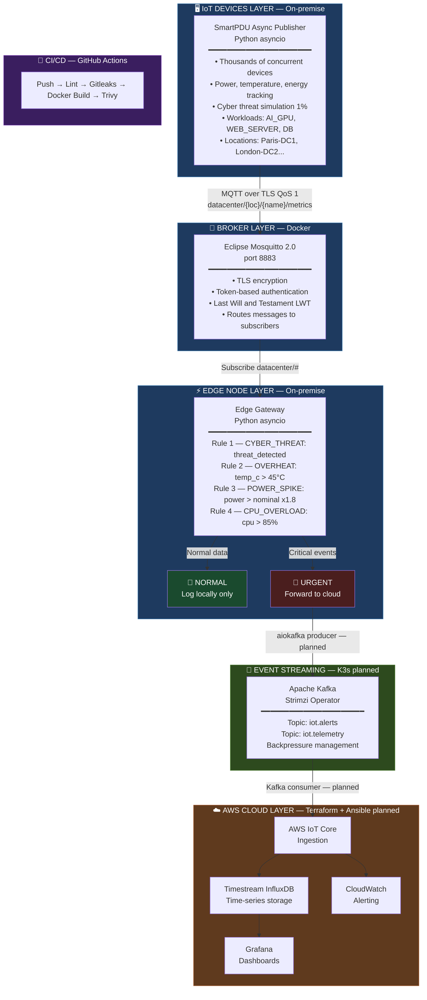

# 🌐 EcoSecure-IoT-Infra

> A production-grade IoT edge computing platform simulating a real datacenter environment — processing telemetry locally at the edge, filtering critical events, and forwarding only relevant data to the cloud.

## 📖 Table of Contents

- [Overview](#-overview)
- [Why Edge Computing?](#-why-edge-computing)
- [Architecture](#-architecture)

---

## 🎯 Overview

**EcoSecure-IoT Infra** is an end-to-end IoT infrastructure project that demonstrates how to build an edge computing platform from scratch. The platform simulates a real data center environment using smart PDUs (power distribution units) that monitor power consumption, temperature, energy usage, and cyberthreat detection across multiple data center sites.

The basic principle is simple:

Process at the edge. Transmit only what matters. Stay in control of your data.
Data is generated by thousands of simulated IoT devices, routed via a local MQTT broker, filtered by a smart edge gateway, and only critical events (cyber threats, overheating, power surges) are transmitted to the cloud. This reduces bandwidth consumption, lowers cloud-related costs, and enables real-time local decision-making.

---

## 💡 Why Edge Computing?

Traditional IoT architectures send all raw data to the cloud for processing. This creates several problems at scale:

| Problem | Cloud-only | Edge Computing |
|---|---|---|
| **Latency** | 100–500ms round trip | <5ms local processing |
| **Bandwidth** | All raw data uploaded | Only filtered data sent |
| **Cost** | High cloud ingestion fees | Drastically reduced |
| **Resilience** | Offline = no processing | Works without internet |
| **Privacy** | All data leaves the site | Sensitive data stays local |
| **Real-time alerts** | Delayed by cloud roundtrip | Instant local triggering |

With thousands of sensors running 24/7 in a factory or across a smart home fleet, the difference is massive — both in performance and operating cost.

---

## 🏗️ Architecture

### High-Level Overview

